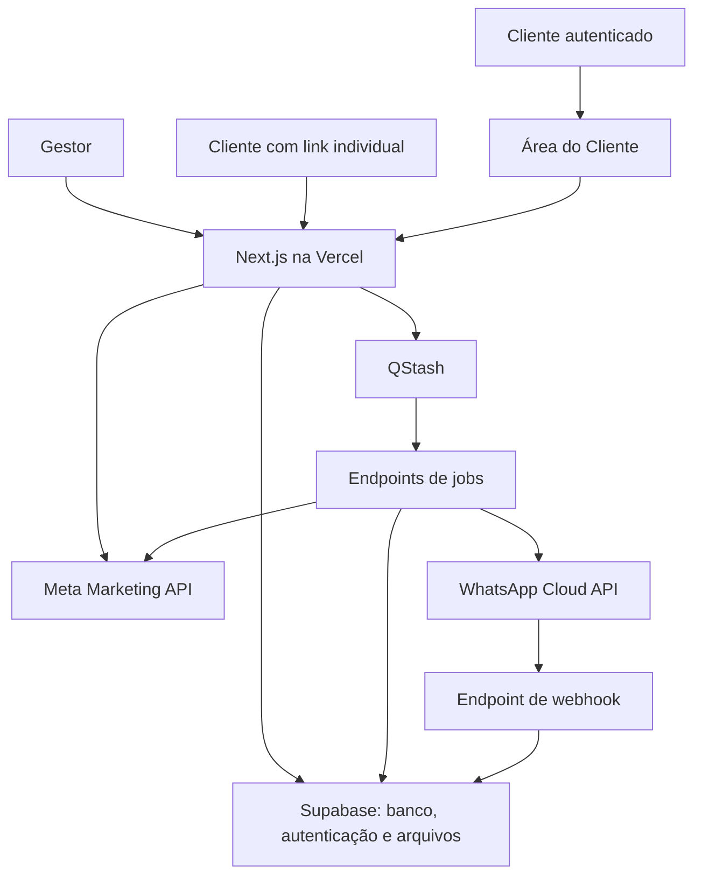

Abaixo está o planejamento completo para levar ao Codex. **Copie esta mensagem integralmente e peça que ele a salve como `docs/PLANEJAMENTO_V1.md` dentro do projeto.**

Este documento consolida as decisões aprovadas e acrescenta padrões de implementação para resolver pontos que ainda estavam abertos. **Até agora, não existe uma aplicação construída, banco provisionado ou integração testada.** O SQL apresentado anteriormente é um rascunho inicial, que deverá ser revisado e testado durante a implementação.

---

**A — Identificação, objetivo e contexto do produto**

**Nome provisório:** iGrow Reports.
**Responsável pelo produto:** Silvio, da iGrow Digital.
**Primeiro usuário:** a própria agência iGrow.
**Evolução comercial:** transformar a plataforma em um SaaS para outras agências.

O nome é provisório e não deve impedir o início do desenvolvimento.

Construir uma plataforma web que permita à agência:

1. Conectar suas integrações com Meta Ads e WhatsApp.
2. Cadastrar clientes e associar suas contas de anúncios.
3. Definir quais resultados e métricas importam para cada cliente.
4. Coletar dados de campanhas, conjuntos e anúncios.
5. Calcular métricas e comparar períodos.
6. Validar os dados antes da publicação.
7. Produzir relatórios web e PDF de qualidade profissional.
8. Adicionar comentários e insights automáticos.
9. Aprovar relatórios quando essa opção estiver habilitada.
10. Entregar relatórios automaticamente por WhatsApp.
11. Acompanhar geração, envio, entrega, leitura e acesso ao relatório.
12. Monitorar falhas e permitir recuperação controlada.
13. Oferecer a cada cliente uma **Área do Cliente autenticada**, com acesso contínuo aos próprios indicadores, períodos, comparações e histórico de relatórios.

A plataforma deve ajudar a **comunicar a performance ao cliente**, além de organizar números.

A **Área do Cliente é um componente central do produto**. O cliente não deve depender apenas do relatório enviado em um período específico: ele poderá entrar na plataforma, consultar seu desempenho, alterar o período de análise dentro dos dados disponíveis, acompanhar a evolução dos principais indicadores e acessar relatórios anteriores.

O painel administrativo deverá transmitir tecnologia, precisão e confiança. O relatório recebido pelo cliente deverá priorizar clareza e facilidade de leitura.

**Princípios do projeto:**

* Simplicidade de uso.
* Dados corretamente interpretados.
* Interface profissional.
* Operação rastreável.
* Segurança entre agências.
* Histórico preservado.
* Automação confiável.
* Custos controlados.
* Construção progressiva sobre código funcional.

---

**B — Escopo fechado da V1**

Tudo abaixo pertence à V1, embora seja implementado em etapas.

| Área          | Funcionalidades                                                             |
| ------------- | --------------------------------------------------------------------------- |
| Fundação      | Next.js, TypeScript, autenticação, estrutura modular e ambientes separados  |
| Multiagência  | Organizações, associação de usuários, permissões e isolamento de dados      |
| Clientes      | Cadastro, edição, arquivamento, destinatários e contas associadas           |
| Meta Ads      | Conexão, consulta de contas, coleta de Insights e diagnóstico da integração |
| Métricas      | Definições, mapeamento de resultados, cálculos, atribuição e comparação     |
| Templates     | Modelos de relatório, configuração e versionamento                          |
| Relatórios    | Geração manual e automática, histórico, versões e snapshots                 |
| Conteúdo      | Campanhas, conjuntos, anúncios, criativos, comentários e insights           |
| Aprovação     | Aprovação opcional vinculada à versão do relatório                          |
| PDF           | Documento próprio produzido a partir do snapshot                            |
| WhatsApp      | Cloud API oficial, templates, envio e processamento de webhooks             |
| Destinatários | Registro de autorização de recebimento e descadastro                        |
| Acesso        | Links individuais, expiração, revogação e registro de acesso                |
| Agendamentos  | Periodicidade, horário, fuso, destinatários e política de envio             |
| Jobs          | Etapas independentes, tentativas, checkpoints e idempotência                |
| Operação      | Dashboard, alertas, health checks, auditoria e recuperação                  |
| Área do cliente | Login do cliente, dashboard próprio, períodos, métricas e histórico de relatórios |
| Experiência   | Onboarding, responsividade, temas e estados completos                       |

**Fora da V1:**

* Google Ads.
* IA generativa.
* Cobrança de assinaturas.
* Planos comerciais e checkout.
* White label completo com domínio por agência.
* Aplicativo mobile nativo.
* CRM de leads.
* Gestão ou edição de campanhas na Meta.
* Automação de conversas comerciais.
* Editor visual livre de relatórios.
* Conversão automática de moedas.
* Kubernetes ou arquitetura de microserviços.

A arquitetura deve permitir expansão futura, mas esses recursos não devem ser implementados antecipadamente.

---

**C — Usuários, permissões e jornadas**

A agência é a organização proprietária dos dados.

Um usuário pode participar de mais de uma agência. Sua permissão pode ser diferente em cada uma.

| Perfil        | Permissões                                                                            |
| ------------- | ------------------------------------------------------------------------------------- |
| Proprietário  | Administração completa da agência, equipe e integrações                               |
| Administrador | Gestão operacional, equipe, clientes, integrações, relatórios e agendamentos          |
| Editor        | Clientes, destinatários, templates, relatórios, comentários, aprovação e agendamentos |
| Leitor        | Consulta dos dados e relatórios da agência                                            |

Os perfis acima pertencem à equipe da agência. **Usuários da Área do Cliente são uma categoria separada**: não recebem papel em `agency_users` e só podem acessar os clientes aos quais estejam explicitamente vinculados. Na V1, o acesso do cliente é essencialmente de leitura: indicadores, comparações, relatórios, PDFs e informações de atualização, sem permissão para alterar integrações, campanhas, configurações da agência ou dados de outros clientes.

Somente proprietário e administrador podem gerenciar credenciais e integrações.

O editor pode visualizar o estado operacional das integrações, mas não acessar seus segredos.

A gestão da equipe deve impedir:

* Autopromoção indevida.
* Alteração de usuários de outra agência.
* Remoção do último proprietário.
* Uso de convite já consumido ou expirado.

**Jornada inicial da agência:**

1. Entrar com sua conta.
2. Configurar nome, logo e fuso da agência.
3. Conectar Meta Ads.
4. Conectar WhatsApp.
5. Cadastrar um cliente.
6. Associar suas contas.
7. Configurar o resultado principal.
8. Cadastrar destinatários.
9. Gerar um relatório de teste.
10. Criar o primeiro agendamento.

**Jornada recorrente do gestor:**

1. Consultar o dashboard.
2. Identificar relatórios pendentes ou falhas.
3. Revisar dados e comentários.
4. Aprovar quando necessário.
5. Acompanhar entregas.
6. Corrigir integrações ou configurações com problema.

**Jornada do cliente — Área do Cliente:**

1. Entrar com sua conta.
2. Acessar um dashboard restrito aos clientes aos quais possui vínculo.
3. Consultar os principais indicadores definidos pela agência.
4. Alterar o período de análise dentro do histórico disponível.
5. Comparar períodos quando houver base compatível.
6. Consultar evolução, campanhas, conjuntos, anúncios ou outros blocos permitidos pela configuração.
7. Visualizar a data da última atualização dos dados.
8. Acessar o histórico de relatórios publicados.
9. Abrir relatórios completos e baixar PDFs disponíveis.

**Jornada do cliente — relatório recebido por link:**

1. Receber a mensagem no WhatsApp.
2. Tocar em “Ver relatório”.
3. Abrir diretamente aquela versão pelo navegador, sem exigir login quando o link individual estiver válido.
4. Consultar indicadores, resultados e comentários.
5. Baixar o PDF.
6. Solicitar interrupção dos próximos envios, se desejar.

A Área do Cliente exige autenticação. O link individual de uma versão continua sendo uma credencial independente e pode permitir acesso direto ao relatório sem login, conforme as regras da seção R.

---

**D — Stack aprovada**

| Camada              | Tecnologia                                  |
| ------------------- | ------------------------------------------- |
| Aplicação           | Next.js com App Router                      |
| Linguagem           | TypeScript em modo estrito                  |
| Interface           | Tailwind CSS                                |
| Componentes         | Primitivos shadcn/ui e componentes próprios |
| Animações           | Motion                                      |
| Gráficos            | Apache ECharts                              |
| Ícones              | Lucide                                      |
| Fontes              | Geist Sans e Geist Mono                     |
| Banco               | PostgreSQL no Supabase                      |
| Autenticação        | Supabase Auth                               |
| Arquivos            | Supabase Storage                            |
| Jobs e agendamentos | Upstash QStash                              |
| Hospedagem          | Vercel                                      |
| Anúncios            | Meta Marketing API                          |
| Mensagens           | WhatsApp Cloud API oficial                  |
| PDF                 | `@react-pdf/renderer`                       |
| Validação           | Zod                                         |
| Erros               | Sentry                                      |
| Código              | Git e GitHub                                |
| Testes de lógica    | Vitest ou equivalente compatível            |
| Testes de navegação | Playwright                                  |
| Testes de banco     | SQL/pgTAP com Supabase local                |

O App Router oferece os recursos necessários para organizar páginas, componentes de servidor e endpoints no mesmo projeto. ([Next.js][1])

**Regras técnicas:**

* Escolher versões estáveis e compatíveis no início da implementação.
* Registrar as versões no lockfile.
* Usar uma única ferramenta de gerenciamento de pacotes.
* Preservar ferramentas e dependências adequadas se já existir um projeto.
* Não adicionar um ORM apenas por convenção.
* Utilizar migrations SQL como fonte da estrutura do banco.
* Gerar tipos TypeScript a partir do schema.
* Usar uma biblioteca adequada para cálculos decimais financeiros.
* Usar uma biblioteca confiável para datas e fusos IANA.

---

**E — Arquitetura da aplicação**

Construir um **monólito modular**: uma aplicação e um repositório, com módulos internos bem separados.

A fila é um serviço externo que chama endpoints da própria aplicação. Não haverá um processo permanente de worker dentro de uma Function da Vercel.

**Responsabilidades:**

| Camada                | Responsabilidade                               |
| --------------------- | ---------------------------------------------- |
| Páginas e componentes | Exibição e interação                           |
| Serviços de aplicação | Executar casos de uso e conferir permissões    |
| Módulos de domínio    | Aplicar regras de negócio                      |
| Repositórios          | Ler e escrever dados                           |
| Adaptadores           | Conversar com Meta, WhatsApp, QStash e Storage |
| Jobs                  | Executar etapas persistidas e recuperáveis     |

O frontend não deve interpretar diretamente os payloads da Meta.

Nenhuma integração deve depender de o usuário manter o navegador aberto.

---

**F — Organização do repositório**

Usar uma estrutura semelhante à seguinte, adaptando apenas o necessário ao projeto existente:

| Caminho                     | Conteúdo                                  |
| --------------------------- | ----------------------------------------- |
| `src/app/`                  | Rotas, layouts e endpoints                |
| `src/components/ui/`        | Primitivos de interface                   |
| `src/components/layout/`    | Menu, topo e estrutura administrativa     |
| `src/components/charts/`    | Componentes de gráficos                   |
| `src/modules/agencies/`     | Agências, equipe e permissões             |
| `src/modules/clients/`      | Clientes e destinatários                  |
| `src/modules/client-portal/` | Área do Cliente, vínculos, dashboard e histórico |
| `src/modules/integrations/` | Configuração e diagnóstico de integrações |
| `src/modules/meta/`         | Cliente da API e coleta                   |
| `src/modules/metrics/`      | Normalização e cálculos                   |
| `src/modules/templates/`    | Templates e versões                       |
| `src/modules/reports/`      | Relatórios, snapshots e aprovação         |
| `src/modules/whatsapp/`     | Templates, mensagens e webhooks           |
| `src/modules/schedules/`    | Agendamentos e ocorrências                |
| `src/modules/deliveries/`   | Entregas e tentativas                     |
| `src/modules/access/`       | Links, revogação e acessos                |
| `src/modules/operations/`   | Alertas, saúde e auditoria                |
| `src/jobs/`                 | Implementação das etapas assíncronas      |
| `src/lib/`                  | Infraestrutura compartilhada              |
| `src/types/`                | Tipos compartilhados                      |
| `supabase/migrations/`      | Migrations                                |
| `supabase/tests/`           | Testes de banco e permissões              |
| `tests/`                    | Testes de aplicação                       |
| `docs/`                     | Planejamento e documentação               |
| `public/`                   | Arquivos públicos realmente necessários   |

**Documentação obrigatória:**

* `README.md`: instalação e execução.
* `docs/PLANEJAMENTO_V1.md`: este documento.
* `docs/IMPLEMENTACAO.md`: etapas e progresso.
* `docs/ARQUITETURA.md`: decisões técnicas.
* `docs/METRICAS.md`: fórmulas e mapeamentos.
* `docs/INTEGRACOES.md`: configuração dos provedores.
* `docs/OPERACAO.md`: diagnóstico e recuperação.
* `.env.example`: nomes das variáveis sem credenciais.

---

**G — Modelo de dados**

Toda entidade pertencente a uma agência deve possuir `agency_id`, diretamente ou por uma relação inequívoca e protegida.

Usar UUIDs internos. IDs externos da Meta devem ser armazenados como texto.

| Tabela                      | Finalidade e campos principais                        |
| --------------------------- | ----------------------------------------------------- |
| `agencies`                  | Nome, logo, timezone, configurações e datas           |
| `agency_users`              | Agência, usuário e papel                              |
| `agency_invitations`        | Convite, email, papel, expiração e consumo            |
| `clients`                   | Nome, logo, observações, arquivamento                 |
| `client_users`              | Vínculo entre usuário autenticado e cliente, com estado e datas |
| `client_recipients`         | Cliente, nome, telefone, autorização e descadastro    |
| `recipient_consent_events`  | Histórico de autorização e revogação                  |
| `integrations`              | Tipo, agência, estado e última verificação            |
| `integration_secrets`       | Credenciais criptografadas, em schema privado         |
| `meta_connections`          | Identidade externa, permissões e metadados            |
| `meta_ad_accounts`          | ID externo, nome, moeda e timezone                    |
| `client_ad_accounts`        | Associação entre cliente e conta                      |
| `whatsapp_connections`      | WABA, número, identidade externa e estado             |
| `whatsapp_templates`        | Nome, idioma, categoria, componentes e estado         |
| `metric_definitions`        | Chave, unidade, fórmula, origem e agregação           |
| `client_metric_mappings`    | Resultado principal, ações de origem e regras         |
| `report_templates`          | Identidade do template                                |
| `report_template_versions`  | Número da versão e configuração imutável              |
| `report_schedules`          | Cliente, periodicidade, horário, timezone e políticas |
| `schedule_ad_accounts`      | Contas selecionadas no agendamento                    |
| `schedule_recipients`       | Destinatários selecionados                            |
| `schedule_occurrences`      | Cada execução prevista, com horário UTC e estado      |
| `report_jobs`               | Etapa, tentativas, bloqueio temporário e checkpoint   |
| `reports`                   | Identidade do relatório e ligação ao cliente          |
| `report_versions`           | Versão, período, snapshot de configuração e estado    |
| `report_data_snapshots`     | Dados brutos sanitizados e metadados de coleta        |
| `report_metrics`            | Métricas calculadas da versão                         |
| `report_entities`           | Campanhas, conjuntos e anúncios da versão             |
| `report_insights`           | Insights, regras e evidências                         |
| `report_comments`           | Comentário, autor e vínculo à versão                  |
| `report_approvals`          | Versão aprovada, autor e data                         |
| `creative_snapshots`        | Arquivo capturado, origem, hash e estado              |
| `report_access_tokens`      | Hash do token, destinatário, versão e expiração       |
| `report_access_events`      | Eventos de acesso classificados                       |
| `deliveries`                | Entrega lógica para um destinatário                   |
| `delivery_attempts`         | Cada tentativa de envio                               |
| `delivery_events`           | Eventos externos e internos da entrega                |
| `webhook_events`            | Recebimento, deduplicação e processamento             |
| `outbox_events`             | Ações externas pendentes após transação               |
| `integration_health_checks` | Resultado de verificações                             |
| `alerts`                    | Alertas operacionais                                  |
| `audit_logs`                | Ações relevantes de usuários e sistema                |

Os nomes podem ser ajustados para melhorar a consistência. As responsabilidades e os relacionamentos devem ser preservados.

**Regras estruturais:**

* Criar índices para agência, cliente, período, estado e IDs externos.
* Usar `timestamptz` para instantes.
* Usar `date` para datas locais dos períodos.
* Usar `numeric` para dinheiro e valores calculados.
* Criar restrições únicas para idempotência.
* Criar referências compostas que impeçam relações entre agências diferentes.
* Preservar históricos ao arquivar clientes e contas.
* Não aplicar exclusão em cascata indiscriminada sobre relatórios e auditoria.
* Tornar versões publicadas e snapshots selados imutáveis.

**Modelo híbrido das entidades de relatório:**

Campos estruturais:

* Agência.
* Versão do relatório.
* Tipo: campanha, conjunto ou anúncio.
* ID externo.
* ID externo do pai.
* Nome capturado.
* Objetivo.
* Estado capturado.
* Investimento.
* Impressões.
* Alcance, quando disponível.

Campos flexíveis:

* `metrics_json`.
* `metadata_json`.
* Informações de qualidade e disponibilidade.

Todos os registros de métricas e entidades devem pertencer à **versão do relatório**, permitindo reconstruir exatamente o histórico.

---

**H — Autenticação, isolamento e segurança**

Usar Supabase Auth.

Na V1 interna, o acesso será controlado por cadastro inicial e convites. Não haverá cadastro público irrestrito de novas agências.

**Regras de autorização:**

1. Identificar o usuário autenticado.
2. Verificar sua associação à agência.
3. Conferir seu papel.
4. Executar a operação no contexto correto.
5. Aplicar RLS no banco.

**`agency_id` não é o ID do usuário.** Uma agência possui vários usuários, e um usuário pode pertencer a várias agências.

O Supabase combina permissões de tabela com políticas RLS. A chave privilegiada pode ignorar RLS e deve permanecer exclusivamente no servidor. ([Supabase Docs][2])

**Exigências:**

* RLS nas tabelas expostas.
* Permissões de tabela explicitamente definidas.
* Testes de acesso permitido e negado.
* Usuários da Área do Cliente só podem ler dados e relatórios dos clientes aos quais estejam explicitamente vinculados.
* O vínculo de cliente não concede acesso à administração da agência, integrações, segredos, equipe ou outros clientes.
* Operações administrativas sobre vínculos da Área do Cliente exigem papel autorizado da agência.
* Políticas correspondentes no Storage.
* Autorização em cada operação de servidor.
* Cookies e sessões configurados corretamente.
* Proteção das operações mutáveis.
* Convites com token seguro, expiração e consumo único.
* Bootstrap do primeiro proprietário por procedimento controlado.
* Segredos fora das tabelas acessíveis ao navegador.

A chave privilegiada não deve ser o caminho padrão de todo CRUD. Operações comuns devem preservar o contexto do usuário.

**Credenciais das integrações:**

* Criptografia AES-256-GCM.
* Nonce exclusivo por criptografia.
* Armazenamento do identificador da chave.
* Chave mestra somente no ambiente do servidor.
* Processo documentado de rotação.
* Tokens removidos dos logs, erros e respostas.
* Nenhum segredo com prefixo `NEXT_PUBLIC_`.

Funções com `security definer` devem ter escopo restrito, permissões explícitas e `search_path` controlado.

---

**I — Integração com Meta Ads**

A integração será diretamente com a Meta Marketing API.

Criar um adaptador próprio, por exemplo `MetaClient`, usando chamadas HTTP.

**Operações necessárias:**

* Validar a conexão.
* Consultar contas acessíveis.
* Consultar metadados da conta.
* Coletar Insights.
* Consultar campanhas.
* Consultar conjuntos.
* Consultar anúncios.
* Consultar criativos.
* Criar e acompanhar consultas assíncronas quando necessário.

**Configuração:**

* Versão da Graph API centralizada.
* Timeout explícito.
* Tratamento de erros.
* Controle de tentativas.
* Paginação completa.
* Observação de limites de uso.
* Registro sanitizado da requisição.

**Acesso:**

A V1 é de leitura. Solicitar apenas as permissões necessárias.

O fato de a plataforma ser usada internamente pela iGrow **não garante que todas as contas acessadas sejam próprias**. Contas de clientes podem exigir Advanced Access e outras etapas de aprovação, conforme a configuração do aplicativo e dos negócios envolvidos. A coleção da Meta diferencia acesso a contas próprias e de terceiros. ([Postman API Network][3])

O Codex deverá:

1. Identificar o aplicativo e as contas efetivamente envolvidos.
2. Conferir o modelo de acesso disponível.
3. Documentar permissões e dependências externas.
4. Implementar a integração adequada.
5. Não declarar funcionamento antes de consultar uma conta real autorizada.

Para o uso inicial, uma credencial de servidor pode ser configurada pelo administrador, desde que válida para as contas necessárias.

A camada deve permitir adicionar OAuth por agência posteriormente.

Se OAuth for implementado:

* Validar `state`.
* Restringir URLs de retorno.
* Consumir a autorização uma única vez.
* Não registrar código ou token em logs.
* Vincular a conexão à agência autorizada.

**Health check:**

* Token válido ou inválido.
* Permissões observadas.
* Contas acessíveis.
* Contas configuradas que perderam acesso.
* Última consulta bem-sucedida.
* Última falha.
* Limitação de uso, quando informada.
* Data e hora da verificação.

“Conectado” e “saudável” devem ser estados distintos.

---

**J — Coleta e preservação dos dados**

A coleta deve ser completa e rastreável.

**Regras:**

* Buscar objetos que tiveram atividade durante o período.
* Incluir campanhas pausadas ou encerradas que participaram do período.
* Não filtrar apenas pelo estado atual “ativo”.
* Preservar nomes e configurações capturados.
* Buscar todas as páginas.
* Distinguir resposta vazia de erro.
* Interromper a publicação quando uma coleta obrigatória estiver incompleta.
* Usar consultas assíncronas para volumes que exijam esse mecanismo.
* Persistir o ID da consulta externa.
* Fazer polling por jobs separados.
* Evitar loops longos esperando uma resposta dentro de uma Function.

**Guardar por coleta:**

* Conta.
* Período.
* Nível consultado.
* Campos solicitados.
* Filtros.
* Atribuição.
* Versão da API.
* Momento da coleta.
* Identificadores de requisição disponíveis.
* Resultado e qualidade.
* Payload sanitizado.

Remover tokens e URLs de paginação com credenciais antes de armazenar dados brutos.

Não coletar dados pessoais de leads: o produto trabalha com performance agregada dos anúncios.

**Pipeline de dados:**

1. Resposta bruta.
2. Normalização.
3. Mapeamento dos resultados.
4. Cálculo.
5. Validação.
6. Snapshot imutável.
7. Renderização.

Quando uma etapa já estiver concluída, uma tentativa posterior deve continuar do checkpoint.

Uma nova coleta que altere os resultados deve originar uma nova versão, sem substituir o histórico publicado.

---

**K — Motor de métricas**

Cada métrica deve ter uma definição explícita.

**Definição mínima:**

* Chave interna.
* Rótulo.
* Descrição.
* Unidade.
* Origem.
* Fórmula.
* Tipo de agregação.
* Direção desejável.
* Precisão de exibição.
* Regras de indisponibilidade.
* Versão da definição.

| Métrica            | Regra                                              |
| ------------------ | -------------------------------------------------- |
| Investimento       | Valor gasto no escopo selecionado                  |
| Impressões         | Impressões retornadas para o escopo                |
| Alcance            | Valor retornado no nível consultado                |
| Cliques            | Tipo de clique explicitamente definido             |
| CTR de link        | Cliques de link ÷ impressões × 100                 |
| CPC de link        | Investimento ÷ cliques de link                     |
| CPM                | Investimento ÷ impressões × 1.000                  |
| Leads              | Ação de lead definida no mapeamento                |
| CPL                | Investimento do escopo ÷ leads do mesmo escopo     |
| Conversas          | Ação de conversa definida no mapeamento            |
| Custo por conversa | Investimento ÷ conversas do mesmo escopo           |
| Compras            | Ação de compra definida no mapeamento              |
| CPA                | Investimento ÷ resultado principal do mesmo escopo |
| Receita atribuída  | Valor atribuído ao evento de compra configurado    |
| ROAS               | Receita atribuída ÷ investimento                   |

**Regras obrigatórias:**

* Não tratar todos os cliques como cliques de link.
* Não somar aliases de ações que representem o mesmo evento.
* Não somar leads, compras e conversas como um único resultado.
* Não calcular médias simples de CPL, CPC, CTR ou ROAS.
* Recalcular índices a partir de numeradores e denominadores.
* Usar o mesmo escopo para custo e resultado.
* Não somar alcance entre campanhas ou dias para simular alcance único.
* Em múltiplas contas, exibir alcance por conta, sem inventar deduplicação.
* Diferenciar `0`, indisponível, não aplicável e falha de coleta.
* Divisão por zero deve produzir valor indisponível, nunca infinito.
* Arredondar para exibição, preservando precisão no cálculo.

**Resultado principal:**

Configurável por cliente, com possibilidade de regra por campanha.

Exemplos:

* Leads no site.
* Leads em formulário instantâneo.
* Conversas iniciadas.
* Compras.
* Outro evento suportado e validado.

Se houver objetivos diferentes no relatório, agrupar os resultados por tipo.

**Variação:**

`(atual − anterior) ÷ anterior × 100`

Se o anterior for zero, exibir “Sem base de comparação” ou um rótulo equivalente.

“Positivo” depende da métrica:

* Crescimento de leads pode ser favorável.
* Redução de CPL pode ser favorável.
* Crescimento de investimento é informativo, sem aprovação automática.
* Crescimento de CTR não prova qualidade dos leads.

Receita atribuída pela Meta deve ser identificada dessa forma, sem apresentar o valor como faturamento confirmado da empresa.

---

**L — Períodos, atribuição, moedas e fusos**

Separar:

1. Fuso dos dados.
2. Fuso de envio.
3. Fuso de exibição do usuário.
4. Instante UTC armazenado.

**Padrões iniciais:**

* Agência iGrow: `America/Sao_Paulo`.
* Dados: timezone informado pela conta Meta.
* Horário de envio: timezone do agendamento.
* Instantes: UTC.
* Datas visíveis: português brasileiro.

**Períodos suportados:**

* Dia anterior.
* Últimos 7 dias completos.
* Semana anterior: segunda a domingo.
* Mês anterior completo.
* Intervalo personalizado para geração manual.

As datas apresentadas ao usuário são inclusivas.

Internamente, pode-se usar um intervalo com limite final exclusivo, desde que a conversão para a API seja explícita e testada.

**Comparações:**

* Intervalo anterior de igual duração.
* Mês anterior para relatório mensal.
* Sem comparação.

Quando meses possuírem durações diferentes, mostrar os períodos completos. Não sugerir equivalência perfeita de duração.

**Atribuição:**

Registrar na configuração e no snapshot:

* Estratégia utilizada.
* Janelas aplicáveis.
* Configuração de conta ou conjunto, quando usada.
* Critério de data do evento, quando aplicável.
* Parâmetros efetivamente enviados.
* Limitações conhecidas.

Os parâmetros exatos devem ser validados na versão da API escolhida.

Os dois períodos de uma comparação precisam usar critérios equivalentes.

**Múltiplas contas:**

* Um cliente pode ter várias contas.
* Um relatório pode selecionar várias contas.
* Bloquear consolidação financeira de moedas diferentes na V1.
* Para simplificar a V1, bloquear consolidação quando os fusos das contas forem diferentes.
* Exibir a origem das contas no relatório.
* Somar apenas métricas cuja definição permita agregação.
* Não consolidar eventos incompatíveis sob um único resultado.
* Preservar métricas não aditivas por conta.

---

**M — Templates de relatório**

Templates são configurações de conteúdo e apresentação, com versões.

**Configurações:**

* Nome.
* Descrição.
* Métricas selecionadas.
* Resultado principal.
* Ordem dos indicadores.
* Comparação.
* Gráfico de evolução.
* Campanhas.
* Conjuntos.
* Anúncios.
* Criativos.
* Quantidade de destaques.
* Comentário do gestor.
* Insights automáticos.
* Identidade visual.
* PDF habilitado.
* Aprovação necessária.

**Modelos iniciais:**

| Modelo            | Indicadores principais                               |
| ----------------- | ---------------------------------------------------- |
| Captação de leads | Investimento, leads, CPL e métricas de contexto      |
| Conversas         | Investimento, conversas e custo por conversa         |
| Vendas            | Investimento, compras, CPA, receita atribuída e ROAS |
| Personalizado     | Seleção entre métricas suportadas                    |

Esses modelos usam o mesmo motor e a mesma estrutura de relatórios.

**Versionamento:**

* Editar um template cria uma nova versão.
* Relatórios antigos mantêm a versão original.
* Agendamentos ficam vinculados a uma versão explícita.
* A adoção de uma nova versão pelos agendamentos exige uma ação identificável.
* Arquivar um template preserva seu histórico.
* Duplicar cria um template independente.

A V1 não terá editor visual livre. Usará blocos configuráveis com layouts profissionais predefinidos.

---

**N — Relatório web, PDF e snapshots**

Cada relatório possui identidade própria e uma ou mais versões.

**Snapshot de uma versão:**

* Agência e cliente.
* Identidade visual.
* Contas selecionadas.
* Moeda e timezone.
* Períodos.
* Atribuição.
* Versão da API.
* Versão do motor de métricas.
* Mapeamentos.
* Versão do template.
* Dados calculados.
* Campanhas, conjuntos e anúncios.
* Insights e comentário.
* Criativos capturados.
* Informações de qualidade.
* Data da coleta e geração.

**Estrutura do relatório web:**

1. Identificação do cliente e agência.
2. Período.
3. Indicadores principais.
4. Comparação.
5. Evolução no tempo.
6. Destaques.
7. Campanhas.
8. Conjuntos e anúncios, conforme template.
9. Criativos.
10. Comentário do gestor.
11. Informações sobre origem e atualização.
12. Download do PDF.

**Requisitos:**

* Mobile-first.
* Conteúdo legível.
* Tabelas adaptadas ao celular.
* Métricas com unidade.
* Valores indisponíveis claramente identificados.
* Data da coleta visível.
* Sem necessidade de login para quem possui link válido.
* Usuários autenticados na Área do Cliente também podem abrir as versões às quais seu vínculo autoriza acesso.
* Sem depender de consultas à Meta para abrir um relatório já produzido.

**Área do Cliente e dados correntes:**

A Área do Cliente não deve ser apenas uma lista de PDFs. Ela deve oferecer uma visão navegável do desempenho do cliente usando os dados já coletados e normalizados pela plataforma.

* Dashboard próprio por cliente.
* Seleção de período dentro do histórico disponível.
* Comparação entre períodos compatíveis.
* Indicadores principais configurados pela agência.
* Evolução temporal das métricas suportadas.
* Detalhamento de campanhas, conjuntos, anúncios e criativos quando habilitado.
* Data e hora da última atualização.
* Histórico de relatórios publicados.
* Acesso aos PDFs e versões liberadas.
* Estados claros para dado ausente, desatualizado ou ainda não coletado.

A Área do Cliente deve reutilizar o mesmo motor de métricas e as mesmas definições utilizadas na geração dos relatórios, evitando divergência entre o que o cliente vê no dashboard e o que recebe em uma versão publicada.

**PDF:**

* Usar `@react-pdf/renderer`.
* Produzir documento próprio.
* Gerar a partir do mesmo snapshot do relatório web.
* Paginar tabelas.
* Evitar cortes de texto.
* Incorporar fontes e imagens necessárias.
* Exibir cliente, período, agência e paginação.
* Identificar a versão.
* Testar acentos e formatação brasileira.

**Criativos:**

* Capturar thumbnails ou assets autorizados.
* Guardar arquivo, hash e metadados.
* Não depender permanentemente de URL externa da Meta.
* Suportar anúncios com múltiplos assets quando disponíveis.
* Usar representação limitada claramente identificada quando necessário.
* Preservar o asset utilizado na versão histórica.
* Falha em um criativo opcional gera aviso; falha em dado obrigatório bloqueia a publicação.

Não baixar arquivos a partir de URLs arbitrárias fornecidas pelo usuário. Aplicar validação de origem, tipo, tamanho e redirecionamentos.

---

**O — Insights, comentários e aprovação**

**Insights automáticos por regras**

A V1 não usa IA generativa.

Cada insight deve registrar:

* Regra e versão.
* Métricas usadas.
* Valores atuais e anteriores.
* Escopo.
* Evidência.
* Texto produzido.
* Classificação informativa ou de atenção.

Exemplos:

| Condição                                                  | Texto possível                                                          |
| --------------------------------------------------------- | ----------------------------------------------------------------------- |
| Leads aumentaram e CPL caiu                               | O período apresentou mais leads com menor custo por lead                |
| Campanha concentra mais de 50% dos resultados compatíveis | A campanha concentrou determinada parcela dos resultados                |
| Investimento com zero resultado confirmado                | Houve investimento sem resultados registrados para o evento configurado |
| Base anterior indisponível                                | A comparação não está disponível para este período                      |

**Regras:**

* Não inferir causa sem evidência.
* Não afirmar qualidade comercial sem dados comerciais.
* Não afirmar vendas confirmadas a partir de cliques.
* Não produzir comparação sobre bases incompatíveis.
* Aplicar limites mínimos para evitar conclusões sobre variações irrelevantes.
* Manter thresholds configuráveis no código ou configuração.

**Comentário do gestor**

Opções:

* Insights automáticos.
* Comentário do gestor.
* Ambos.
* Sem comentário.

Registrar autor e data.

**Aprovação opcional**

Se habilitada:

1. Produzir uma versão de revisão.
2. Permitir visualização autenticada pela agência.
3. Aguardar aprovação.
4. Registrar autor, data e versão.
5. Liberar a entrega.

Qualquer alteração em conteúdo, comentário, dados ou template após aprovação exige nova versão e nova aprovação.

A aprovação deve se vincular a uma versão exata.

Não enviar automaticamente uma versão que perdeu sua aprovação.

Na ausência de aprovação, manter pendente e alertar. Nunca aprovar automaticamente pelo decurso do tempo.

---

**P — WhatsApp, templates e destinatários**

Usar WhatsApp Cloud API oficial.

A V1 envia notificações de relatório a destinatários individuais.

**Integração deve guardar:**

* Agência.
* WABA.
* ID do número.
* Nome de exibição.
* Credencial criptografada.
* Estado.
* Última verificação.
* Informações operacionais disponíveis.

Não pressupor que um número já utilizado no WhatsApp Business esteja automaticamente apto à integração. Validar a configuração oficial disponível, inclusive coexistência quando aplicável.

**Destinatários:**

* Cliente.
* Nome.
* Telefone em formato internacional validado.
* Ativo/inativo.
* Autorização de recebimento.
* Data e origem da autorização.
* Data do descadastro.
* Histórico de alterações.

Número cadastrado não equivale a autorização de recebimento.

**Templates WhatsApp:**

* ID externo.
* Nome.
* Idioma.
* Categoria informada pelo provedor.
* Estado.
* Componentes.
* Parâmetros.
* Última sincronização.
* Integração responsável.

Os envios usarão templates adequados e aprovados, com botão para abrir o relatório. Templates interativos permitem botões de acesso a websites. ([Postman API Network][4])

**Texto inicial sugerido para submissão:**

> Olá, {{1}}. O relatório de {{2}}, referente ao período {{3}}, está disponível. Acesse pelo botão abaixo.

Botão: **Ver relatório**.

A aprovação e a categoria serão determinadas pelo provedor. O sistema não deve inventar o estado “Aprovado”.

**Validação imediatamente antes do envio:**

* Integração disponível.
* Template utilizável.
* Destinatário ativo.
* Autorização válida.
* Sem descadastro posterior.
* Telefone válido.
* Relatório pronto.
* Aprovação válida, quando necessária.
* Link válido.
* Ambiente autorizado a enviar.

**Descadastro:**

* Ação administrativa.
* Opção no relatório.
* Processamento de respostas de descadastro pelo webhook.

Alterar o estado por uma operação explícita, não por um simples GET que possa ser acionado por preview.

O descadastro deve cancelar futuros envios pendentes para aquele destinatário. Não apaga automaticamente mensagens já entregues.

---

**Q — Entregas, tentativas e webhooks**

Separar a entrega lógica das tentativas de envio.

**Entrega lógica:** uma versão destinada a uma pessoa.

**Tentativa:** uma chamada concreta ao provedor.

**Estados sugeridos:**

* Pendente.
* Bloqueada.
* Enviando.
* Aceita pelo provedor.
* Enviada.
* Entregue.
* Lida.
* Falhou.
* Resultado incerto.
* Cancelada.

Registrar o ID externo `wamid` quando retornado.

Uma resposta de sucesso do envio não deve ser apresentada como “Entregue”. A confirmação de entrega vem do evento correspondente.

**Webhook:**

Endpoint sugerido:

`/api/webhooks/meta/whatsapp`

Deverá:

1. Responder à verificação inicial.
2. Validar a assinatura das notificações.
3. Identificar a integração pelo contexto externo.
4. Persistir o evento.
5. Deduplicar.
6. Responder rapidamente após persistência durável.
7. Processar o evento de forma recuperável.

**Tratamento obrigatório:**

* Eventos repetidos.
* Eventos fora de ordem.
* Eventos anteriores à associação do `wamid`.
* Eventos desconhecidos.
* Falha de processamento.
* Dados inválidos.
* Mensagens recebidas para descadastro.

Um evento “Enviado” recebido depois de “Entregue” não deve fazer a interface retroceder.

Guardar o histórico de eventos e derivar o estado atual por regras explícitas.

O vínculo deve considerar a integração, o número remetente e o identificador da mensagem, evitando associação entre agências.

Mensagens recebidas que não se relacionem ao descadastro não devem transformar a plataforma em um sistema de atendimento.

---

**R — Links individuais e registro de acesso**

Cada destinatário receberá um link próprio, vinculado a uma versão.

Exemplo conceitual:

`https://r.dominio.com/r/TOKEN_ALEATORIO`

**Token:**

* Gerado com fonte criptograficamente segura.
* Pelo menos 32 bytes de aleatoriedade.
* Armazenado permanentemente como hash.
* Vinculado à agência, versão e destinatário.
* Com expiração e revogação.

Se o envio exigir persistir temporariamente o link original, armazená-lo criptografado e remover essa cópia quando não for mais necessária.

**Expiração:**

* 30 dias.
* 90 dias.
* 365 dias.
* Sem expiração, por escolha explícita.

Padrão inicial: 90 dias.

**Autorização de acesso:**

* Token existente.
* Versão liberada.
* Não expirado.
* Não revogado.
* Vínculos corretos.
* Verificação também nos endpoints de PDF e assets.

O link é uma credencial de acesso. Ele identifica o link atribuído ao destinatário, **não comprova quem fisicamente o abriu**.

**Registro de acesso:**

* Não marcar abertura somente por GET.
* Separar previews e crawlers conhecidos.
* Registrar evento após renderização e visibilidade da página.
* Deduplicar eventos da mesma sessão.
* Classificar como acesso provável por navegador.
* Informar limitações na documentação.

**Proteções:**

* `noindex`.
* Sem dados financeiros em metadados de preview.
* Controle de cache.
* Política de referência restritiva.
* Tokens sanitizados em logs e Sentry.
* Sem scripts terceiros desnecessários.
* Limitação de tentativas.

Os buckets de relatórios e PDFs serão privados. URLs assinadas de Storage têm validade própria; revogar um link da aplicação não invalida automaticamente uma URL assinada já emitida. Para controle de revogação por requisição, servir os arquivos por uma rota que revalide o acesso. ([Supabase Docs][5])

Nenhum mecanismo consegue revogar uma cópia de PDF já baixada pelo destinatário.

---

**S — Agendamentos, jobs e idempotência**

**Agendamento:**

* Cliente.
* Contas.
* Template e versão.
* Resultado principal e mapeamento.
* Periodicidade.
* Dia.
* Horário.
* Timezone.
* Regra do período.
* Comparação.
* Destinatários.
* Template WhatsApp.
* Aprovação.
* PDF.
* Expiração dos links.
* Ativo ou pausado.

Mostrar as próximas ocorrências antes de salvar.

O QStash suporta horários recorrentes e timezones IANA. A configuração efetiva deve ser conferida na implementação. ([Upstash Documentation][6])

**Estratégia sugerida:**

* PostgreSQL como fonte dos agendamentos.
* QStash acionando um dispatcher recorrente.
* Dispatcher identificando ocorrências vencidas.
* Criação atômica da ocorrência e dos eventos de fila.
* Jobs processando etapas independentes.
* Reconciliação de ocorrências e jobs parados.

Essa estratégia mantém a lógica de calendário e recuperação sob controle da aplicação.

**Etapas:**

1. Criar ocorrência.
2. Congelar configuração.
3. Coletar dados atuais.
4. Coletar comparação.
5. Normalizar.
6. Calcular.
7. Validar.
8. Capturar criativos.
9. Produzir insights.
10. Preparar relatório.
11. Gerar PDF, se necessário.
12. Aguardar aprovação, se necessário.
13. Liberar a versão.
14. Criar entregas.
15. Enviar.
16. Processar eventos.

Separar o estado da geração do relatório do estado de cada entrega.

**Idempotência no banco:**

| Operação   | Identidade lógica                                            |
| ---------- | ------------------------------------------------------------ |
| Ocorrência | Agendamento + instante previsto                              |
| Geração    | Ocorrência + tipo de geração                                 |
| Etapa      | Execução + etapa + escopo                                    |
| Entrega    | Versão + destinatário + canal + sequência explícita de envio |
| Webhook    | Integração + identidade ou impressão digital do evento       |

A geração de um relatório não deve usar o destinatário como parte da sua identidade: vários destinatários podem receber a mesma versão.

**Execução:**

* Restrições únicas.
* Transações.
* Aquisição atômica de jobs.
* Bloqueio temporário com prazo.
* Checkpoint.
* Recuperação de jobs abandonados.
* Tentativas limitadas.
* Backoff.
* Separação de erros transitórios e permanentes.

Usar um padrão de outbox: salvar a mudança no banco e a intenção de publicar a próxima tarefa na mesma transação.

Os endpoints devem validar a assinatura do QStash pelo corpo original e contexto da requisição. ([Upstash Documentation][7])

A deduplicação do QStash é adicional e possui uma janela limitada; a garantia durável deve permanecer no banco. ([Upstash Documentation][8])

**Caso crítico: timeout no WhatsApp**

Pode ocorrer:

1. A Meta recebe a mensagem.
2. A resposta não chega à aplicação.
3. A aplicação desconhece o resultado.

Nesse caso:

* Marcar “Resultado incerto”.
* Tentar reconciliar por eventos e identificadores disponíveis.
* Não repetir cegamente a chamada.
* Alertar o gestor se não houver confirmação.
* Registrar qualquer reenvio explícito.

Não prometer entrega “exatamente uma vez” por causa de um índice único local.

**Horário de envio:**

Representa o horário pretendido. Dependências externas ou aprovação podem atrasar a entrega.

A interface deve mostrar horário previsto e realizado.

Como padrão operacional, ocorrências atrasadas em até 24 horas podem ser recuperadas automaticamente; atrasos maiores ficam pendentes de revisão para evitar notificações antigas. Esse limite deverá ser configurável.

---

**T — Telas administrativas e navegação**

Menu principal em português:

* Dashboard.
* Clientes.
* Relatórios.
* Templates.
* Agendamentos.
* Entregas.
* Integrações.
* Configurações.

**Dashboard**

* Saudação.
* Estado operacional.
* Clientes ativos.
* Relatórios gerados.
* Taxa de entrega.
* Próximos envios.
* Atividade diária.
* Pendências.
* Alertas.
* Histórico recente.
* Indicadores de comunicação.

**Clientes**

Lista com:

* Nome.
* Contas.
* Resultado principal.
* Último relatório.
* Próximo envio.
* Estado.

Detalhe com:

* Dados.
* Contas.
* Métricas.
* Destinatários.
* Relatórios.
* Agendamentos.
* Histórico.

**Relatórios**

* Filtros por cliente, período e estado.
* Geração manual.
* Histórico de versões.
* Prévia administrativa.
* Comentário.
* Aprovação.
* Download.
* Links.
* Entregas.

**Templates**

* Listagem.
* Criação.
* Edição por blocos.
* Duplicação.
* Versões.
* Prévia.
* Arquivamento.

**Agendamentos**

* Lista.
* Criação guiada.
* Próximas ocorrências.
* Pausa e retomada.
* Histórico de execuções.
* Problemas de configuração.

**Entregas**

* Destinatário.
* Cliente.
* Versão.
* Canal.
* Estado.
* Datas.
* Tentativas.
* Erro.
* Acesso ao relatório.

**Integrações**

* Conectar.
* Diagnosticar.
* Sincronizar contas ou templates.
* Renovar credencial.
* Desconectar.
* Identificar agendamentos afetados.

**Configurações**

* Agência.
* Logo.
* Timezone.
* Equipe.
* Tema.
* Políticas de links.
* Preferências operacionais.

**Área do Cliente**

* Login próprio dentro da mesma base de autenticação.
* Seleção do cliente quando o usuário possuir vínculo com mais de um.
* Dashboard com indicadores principais.
* Seletor de período.
* Comparação.
* Evolução temporal.
* Detalhamento permitido pela agência.
* Histórico de relatórios.
* Download de PDFs liberados.
* Informação de última atualização.
* Perfil básico e saída da conta.
* Nenhum acesso a configurações internas da agência.

**Estados de interface:**

* Carregando.
* Vazio.
* Sem integração.
* Sem permissão.
* Erro.
* Sucesso.
* Dados desatualizados.
* Processando.
* Aguardando aprovação.
* Demonstração.

Todo botão visível deve executar uma ação real ou explicar claramente por que está indisponível.

---

**U — Direção visual e responsividade**

**Painel administrativo:**

* Fundo grafite e azul-marinho quase preto.
* Superfícies em cinza-azulado.
* Azul elétrico e cyan como acentos.
* Violeta em detalhes.
* Verde para sucesso confirmado.
* Âmbar para atenção.
* Vermelho para falhas.

**Tipografia:**

* Geist Sans para textos.
* Geist Mono para números e metadados técnicos.

**Composição:**

* Menu lateral.
* Topo compacto.
* Faixa de operação.
* Indicadores com hierarquia visual.
* Gráfico de atividade.
* Timeline.
* Alertas próximos das ações de correção.

Usar gradientes, transparência e iluminação com moderação.

Os dados devem dominar a interface.

**Motion:**

* Transições curtas.
* Entrada suave de elementos.
* Atualização discreta de números.
* Progresso baseado em etapas reais.
* Respeito a movimento reduzido.
* Sem animação contínua desnecessária.

**Temas:**

* Escuro.
* Claro.
* Sistema.

O modo escuro será a apresentação principal da administração.

**Relatório e Área do Cliente:**

* Fundo claro.
* Identidade discreta da agência e cliente.
* Espaçamento generoso.
* Contraste forte.
* Gráficos limpos.
* Linguagem acessível.

**Responsividade:**

* Administração desktop-first.
* Relatório e Área do Cliente mobile-first.
* Menu adaptado ao celular.
* Tabelas em cards ou rolagem controlada.
* Elementos funcionais com teclado.
* Foco visível.
* Campos com rótulos.
* Informações que não dependam apenas de cor.

Testar em larguras equivalentes a celular, tablet e desktop.

---

**V — Dashboard, observabilidade e recuperação**

O dashboard deve representar dados reais.

Exemplos numéricos anteriores, como 18 clientes ou 99,4% de entrega, são referências de apresentação e não dados comprovados.

**Indicadores:**

| Indicador          | Definição                                               |
| ------------------ | ------------------------------------------------------- |
| Clientes ativos    | Clientes não arquivados no contexto da agência          |
| Relatórios gerados | Versões concluídas no intervalo selecionado             |
| Próximos envios    | Entregas ou ocorrências previstas no horizonte indicado |
| Taxa de entrega    | Entregas confirmadas ÷ envios aceitos da mesma coorte   |
| Leitura            | Mensagens com confirmação de leitura recebida           |
| Acessos            | Links com evento qualificado de navegador               |

Definir denominador, período e unidade.

Quando não houver base, mostrar “Sem dados”.

**Funil:**

Não misturar relatórios com mensagens.

Um relatório enviado para três pessoas gera três entregas.

O funil de comunicação deve usar a mesma população:

* Envios aceitos.
* Enviados.
* Entregues.
* Lidos.
* Com acesso registrado.

A quantidade de relatórios gerados aparece em indicador separado.

Acesso ao relatório e leitura do WhatsApp também podem ocorrer em ordens diferentes. A visualização não deve sugerir uma sequência universal.

**Logs:**

* Estruturados.
* Sanitizados.
* Com correlação entre ocorrência, job, relatório e entrega.
* Com código de erro interno.
* Com identificador externo quando disponível.
* Sem credenciais ou tokens de acesso.

**Alertas:**

* Token inválido.
* Conta inacessível.
* Template indisponível.
* Falha de coleta.
* Dados incompletos.
* PDF obrigatório com falha.
* Job parado.
* Aprovação pendente.
* Falha de envio.
* Resultado de envio incerto.
* Webhook não processado.
* Agendamento inconsistente.

**Recuperação:**

* Reexecutar etapa segura.
* Continuar por checkpoint.
* Renovar conexão.
* Sincronizar templates.
* Cancelar pendência.
* Reenviar explicitamente.
* Revogar link.
* Criar nova versão.

**Auditoria:**

Registrar ações como:

* Alteração de telefone.
* Mudança de autorização.
* Mudança de horário.
* Alteração de mapeamento.
* Criação de versão.
* Aprovação.
* Reenvio.
* Revogação.
* Alteração de integração.

Auditoria e logs de aplicação têm finalidades diferentes e devem ser mantidos separadamente.

---

**W — Ambientes, infraestrutura, configuração e custos**

**Ambientes:**

| Ambiente | Uso                      |
| -------- | ------------------------ |
| Local    | Desenvolvimento e testes |
| Staging  | Homologação              |
| Produção | Operação real            |

Nunca usar produção como banco de desenvolvimento.

Supabase local pode atender ao desenvolvimento. Staging deve ter dados e credenciais separados de produção.

**Vercel:**

* Deploy conectado ao repositório.
* Variáveis por ambiente.
* URLs estáveis para webhooks e jobs.
* Runtime Node onde as dependências exigirem.
* Jobs divididos em etapas menores.
* Observação de duração, memória e tamanho de payload.

Os limites de Functions dependem da configuração e do plano; devem ser conferidos no deploy. ([vercel.com][9])

**Domínios:**

* `app.dominio.com`: administração.
* `r.dominio.com`: relatórios.

Pode-se começar com um único domínio e rotas distintas, mantendo a possibilidade de separação.

**Buckets:**

* `agency-assets`.
* `client-assets`.
* `report-assets`.
* `report-pdfs`.

Privados por padrão, com acesso conforme a finalidade.

**Variáveis previstas:**

* URL pública da aplicação.
* URL pública dos relatórios.
* URL do Supabase.
* Chave pública apropriada do Supabase.
* Chave privilegiada do servidor.
* Versão da Graph API.
* ID do aplicativo Meta.
* Segredo do aplicativo Meta.
* Segredo de verificação do webhook.
* Token QStash.
* Chaves atual e próxima de assinatura QStash.
* Chave de criptografia.
* Identificador da chave de criptografia.
* Configuração do Sentry.
* Identificação do ambiente.
* Configuração de demonstração.
* Política de envios externos.

Os nomes exatos serão documentados no `.env.example`.

**Modo de demonstração:**

* Dados explicitamente fictícios.
* Indicação permanente.
* Integrações simuladas identificadas.
* Nenhum envio real.
* Nenhum estado fictício apresentado como conexão real.
* Separação das rotas e dados de produção.
* Sem bypass de autenticação em produção.

Credenciais ausentes devem gerar um estado “Não configurado”, sem cair silenciosamente em dados demonstrativos.

**Custos:**

Antes do deploy operacional, levantar:

* Plano adequado da Vercel.
* Supabase.
* QStash.
* WhatsApp.
* Storage e tráfego.
* Sentry.
* Domínio.

Não prometer custo zero nem reutilizar preços antigos sem conferir.

Exemplo de dimensionamento: 20 clientes, quatro relatórios mensais e dois destinatários por relatório resultam em aproximadamente 80 relatórios e 160 entregas mensais, além das chamadas de coleta, jobs e verificações.

**Dados e retenção:**

* Minimizar dados pessoais.
* Guardar finalidade e histórico de autorização.
* Definir retenção de payloads, logs, relatórios e assets.
* Disponibilizar procedimentos de exportação e exclusão quando aplicáveis.
* Não apagar automaticamente evidências necessárias à operação.
* Documentar políticas antes da produção.
* Configurar backups conforme o plano.
* Testar restauração.

Não apresentar o software como automaticamente adequado à LGPD apenas por possuir campos de consentimento.

---

**X — Testes e critérios técnicos**

Os testes devem proteger regras importantes, especialmente dados, permissões e efeitos externos.

**Banco e autorização:**

* Agência A não lê nem altera dados da B.
* Usuário sem associação não acessa a agência.
* Leitor não escreve.
* Editor não altera credenciais ou papéis.
* Referências entre agências são rejeitadas.
* Convite consumido não pode ser reutilizado.
* Último proprietário não pode ser removido indevidamente.
* Assets privados respeitam autorização.
* Tokens revogados deixam de autorizar novas requisições.
* Usuário-cliente não acessa outro cliente da mesma agência sem vínculo explícito.
* Usuário-cliente não acessa clientes de outra agência.
* Usuário-cliente não obtém privilégios administrativos por possuir conta autenticada.
* Vínculo desativado remove acesso à Área do Cliente em novas requisições.
* Histórico e relatórios mostrados na Área do Cliente pertencem somente ao cliente autorizado.

**Métricas:**

* Divisão por zero.
* Base anterior zero.
* Dados ausentes.
* Precisão decimal.
* Aliases de ações.
* Resultados de objetivos diferentes.
* Índices calculados por totais.
* Alcance sem soma indevida.
* Moedas incompatíveis.
* Numerador e denominador do mesmo escopo.

**Coleta:**

* Paginação.
* Resposta vazia.
* Erro permanente.
* Limitação temporária.
* Consulta assíncrona.
* Coleta incompleta.
* Campanha pausada com atividade no período.
* Sanitização de credenciais.

**Jobs:**

* Ocorrência duplicada.
* Workers concorrentes.
* Retomada após falha.
* Expiração de bloqueio.
* Outbox não publicada.
* Mensagem repetida.
* Agendamento pausado.
* Ocorrência atrasada.
* Mudança de horário e timezone.

**WhatsApp:**

* Sem autorização.
* Descadastro após entrar na fila.
* Template indisponível.
* Resposta aceita.
* Falha confirmada.
* Timeout de resultado incerto.
* Webhook repetido.
* Webhook fora de ordem.
* Webhook anterior à associação da mensagem.

**Relatório:**

* Versão antiga preservada.
* Aprovação invalidada por nova versão.
* PDF e web com os mesmos valores.
* Link expirado.
* Link revogado.
* Preview não contado como abertura.
* Acesso ao asset de outra versão negado.
* Texto e tabelas legíveis no celular.

**Verificações regulares:**

* TypeScript.
* Lint.
* Build.
* Testes relevantes.
* Navegação principal.
* Revisão de console.
* Revisão visual desktop e mobile.

Usar mocks para falhas controladas, mas homologar as integrações com contas reais autorizadas antes de declarar a V1 operacional.

---

**Y — Plano de implementação e entregas**

Implementar na ordem abaixo, mantendo uma aplicação funcional a cada etapa.

| Etapa                | Entrega                                            | Critério de aceite                                 |
| -------------------- | -------------------------------------------------- | -------------------------------------------------- |
| 1. Preparação        | Repositório, dependências e documentação           | Projeto executa e instruções são reproduzíveis     |
| 2. Design system     | Componentes, temas e shell                         | Interface consistente e responsiva                 |
| 3. Fundação do banco | Agências, usuários, papéis e RLS                   | Testes de isolamento passam                        |
| 4. Autenticação      | Login, sessão, convite e contexto da agência       | Acesso e permissões funcionam                      |
| 5. Dashboard inicial | Layout com estados vazios e demonstração explícita | Não apresenta dados fictícios como reais           |
| 6. Clientes          | Cadastro, edição, arquivamento e destinatários     | Dados persistem com isolamento                     |
| 7. Meta              | Conexão, contas e diagnóstico                      | Consulta real autorizada funciona                  |
| 8. Coleta            | Insights e histórico sanitizado                    | Paginação e falhas são tratadas                    |
| 9. Métricas          | Normalização, mapeamento e comparação              | Fórmulas e agregações passam nos testes            |
| 10. Templates        | Modelos, configuração e versões                    | Edição não altera relatórios anteriores            |
| 11. Relatórios       | Geração manual, snapshot e visualização            | Versão completa e consistente                      |
| 12. Conteúdo         | Insights, comentários e aprovação                  | Aprovação está vinculada à versão                  |
| 13. PDF e criativos  | Documento e arquivos capturados                    | Web e PDF preservam os mesmos dados                |
| 14. Links            | Acesso individual, expiração e revogação           | Autorização verificada em página e arquivos        |
| 15. WhatsApp         | Templates, envio e eventos                         | Teste real confirma o fluxo                        |
| 16. Automação        | Agendamentos, outbox e pipeline                    | Execuções duplicadas não duplicam operações locais |
| 17. Operação         | Alertas, auditoria e recuperação                   | Falhas podem ser explicadas e tratadas             |
| 18. Área do Cliente  | Login do cliente, vínculos, dashboard, períodos e histórico | Cliente consulta apenas seus próprios dados e relatórios |
| 19. Onboarding       | Fluxo guiado e primeiras configurações             | Usuário consegue completar a configuração          |
| 20. Polimento        | Responsividade, acessibilidade e animações         | Telas e estados revisados                          |
| 21. Homologação      | Piloto com um cliente autorizado                   | Agência e cliente conferem o fluxo ponta a ponta   |
| 22. Produção         | Deploy e documentação operacional                  | Dependências e verificações concluídas             |

**Primeiro incremento concreto esperado do Codex:**

* Projeto Next.js configurado.
* Estrutura modular.
* Design system.
* Menu e layout administrativo.
* Dashboard inicial.
* Migração da fundação.
* Autenticação inicial.
* Testes essenciais de RLS.
* `.env.example`.
* Documentação de execução.

Depois, continuar para cadastro de clientes e integração Meta.

**Homologação piloto:**

Usar um cliente real autorizado, como o Colégio Crescer, somente quando houver acesso e credenciais necessários.

Conferir:

* Conta.
* Período.
* Moeda.
* Timezone.
* Atribuição.
* Resultado principal.
* Investimento.
* Métricas no Ads Manager sob critérios equivalentes.
* Relatório web.
* PDF.
* Envio ao destinatário de teste.
* Eventos recebidos.
* Link.
* Revogação.

Diferenças devem ser investigadas com os snapshots e parâmetros, considerando que a atribuição da plataforma pode atualizar resultados posteriormente.

**Definição de conclusão da V1:**

A V1 está concluída quando um gestor consegue configurar um cliente, gerar um relatório correto, revisá-lo, entregá-lo por WhatsApp, acompanhar os eventos e repetir esse fluxo por agendamento, com isolamento entre agências e recuperação documentada de falhas.

---

**Z — Instrução de execução para o Codex**

Cole a instrução abaixo junto com este planejamento:

> Você é responsável por implementar a plataforma iGrow Reports conforme o planejamento completo apresentado.
>
> Comece inspecionando a pasta selecionada. Se houver código existente, leia suas instruções e preserve o trabalho útil. Se estiver vazia, inicialize o projeto.
>
> Salve o planejamento em `docs/PLANEJAMENTO_V1.md` e mantenha o progresso em `docs/IMPLEMENTACAO.md`.
>
> Use Next.js com App Router, TypeScript, Tailwind, Supabase/PostgreSQL, Vercel, QStash, Apache ECharts, Motion, Lucide e `@react-pdf/renderer`.
>
> Construa um monólito modular com isolamento por agência desde o início.
>
> A interface será em português brasileiro. A administração terá fundo grafite, acentos azul, cyan e violeta. Os relatórios terão apresentação clara e corporativa.
>
> Implemente por incrementos funcionais, seguindo a ordem do planejamento. Comece pela estrutura, design system, migrations, autenticação, RLS e dashboard inicial.
>
> Trabalhe nos arquivos e execute comandos, verificações e testes disponíveis. Não entregue apenas descrições ou exemplos de código.
>
> Consulte a documentação oficial ao implementar integrações, autenticação, parâmetros de métricas e configuração de infraestrutura. Registre as versões utilizadas.
>
> Não confunda demonstração com funcionamento real. Identifique fixtures e integrações simuladas. Uma credencial ausente deve produzir um estado “Não configurado”.
>
> O SQL apresentado na conversa anterior é apenas um rascunho. Revise-o e adapte-o ao schema completo; não o trate como migração já aplicada ou validada.
>
> Não use apenas o `agency_id` recebido do navegador para autorizar ações. Confira usuário, associação e papel. Teste o isolamento no banco.
>
> Preserve snapshots e versões publicados. Não some métricas não aditivas nem agrupe resultados incompatíveis.
>
> Implemente jobs com checkpoints, outbox, restrições únicas e tratamento de tentativas. Trate resultados incertos de envio como um estado próprio.
>
> Não adicione recursos fora da V1. Não implemente cobrança, Google Ads ou IA generativa neste momento.
>
> A **Área do Cliente autenticada faz parte da V1 e é um componente central do produto**. Implemente-a com vínculos explícitos entre usuário e cliente, isolamento por RLS, dashboard próprio, seleção de períodos, comparações, evolução de métricas e histórico de relatórios. Ela deve reutilizar o mesmo motor de métricas da plataforma e nunca conceder acesso às configurações internas da agência.
>
> Resolva escolhas rotineiras de implementação com julgamento técnico e continue sem pedir confirmação a cada etapa.
>
> Quando faltar uma dependência externa, avance no que puder ser implementado e testado independentemente. Depois informe exatamente o que falta e o procedimento necessário.
>
> Não compre serviços, não altere produção existente e não envie mensagens a destinatários reais sem autorização correspondente. Prepare as alterações e testes antes dessas ações.
>
> Ao concluir cada incremento, informe o que funciona, o que foi verificado, o que permanece pendente e a próxima etapa. Nunca declare concluído algo que está apenas desenhado, simulado ou sem teste.
>
> Seu primeiro objetivo é entregar uma fundação executável e visualizável. A partir dela, continue a implementação até cumprir os critérios da V1.

**O contexto que acompanha o projeto deve ser este documento completo.** A instrução da seção Z orienta a execução; as seções A a Y definem o que deverá ser construído.

[1]: https://nextjs.org/docs/app?utm_source=chatgpt.com "Next.js Docs: App Router"
[2]: https://supabase.com/docs/guides/database/postgres/row-level-security?utm_source=chatgpt.com "Row Level Security"
[3]: https://www.postman.com/meta/facebook-marketing-api/collection/0zr4mes/facebook-marketing-api-mapi?utm_source=chatgpt.com "Facebook Marketing API (MAPI) | Get Started"
[4]: https://www.postman.com/meta/whatsapp-business-platform/request/lwtlz1k/send-message-template-interactive?utm_source=chatgpt.com "Send Message Template Interactive | WhatsApp Cloud API"
[5]: https://supabase.com/docs/guides/storage/serving/downloads?utm_source=chatgpt.com "Serving assets from Storage"
[6]: https://upstash.com/docs/qstash/features/schedules?utm_source=chatgpt.com "Schedules"
[7]: https://upstash.com/docs/qstash/howto/signature?utm_source=chatgpt.com "Verify Signatures"
[8]: https://upstash.com/docs/qstash/features/deduplication?utm_source=chatgpt.com "Deduplication"
[9]: https://vercel.com/docs/functions/configuring-functions/duration?utm_source=chatgpt.com "Configuring Maximum Duration for Vercel Functions"
